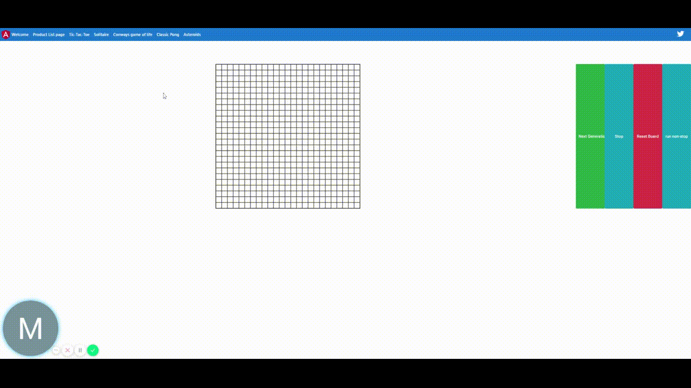

# AcmeProductNgrx Porfolio project

- This is a porfolio project contianing multiple small 2d games

- Games
    - TicTacToe
    - Solitaire
    - Conways game of life
    - Classic Pong vs ai
    - Asteroids -> in development

## Goals of porfolio: 

The main goals of these projects are to exercise my knowledge of design patters, OOP, and multiple techniques

in functional programming. Also ability to demonstrate my ability as an engineer, to achieve this I chose multiple

Complex problems to solve both using logic and algorithmic persspicacity, also problems that are big enough to 

grow a codebase to a point where organization and neatness is necessary and paramount to even completing the problem.

# TicTacToe vs Bot

- Uses recursive algorithm for determining best move

# Solitaire - Note please zoom out to 80% to scale

# Conway's Game of Life

- [Conway's Game of Life wiki link](https://en.wikipedia.org/wiki/Conway%27s_Game_of_Life)

# Classic Pong 

    